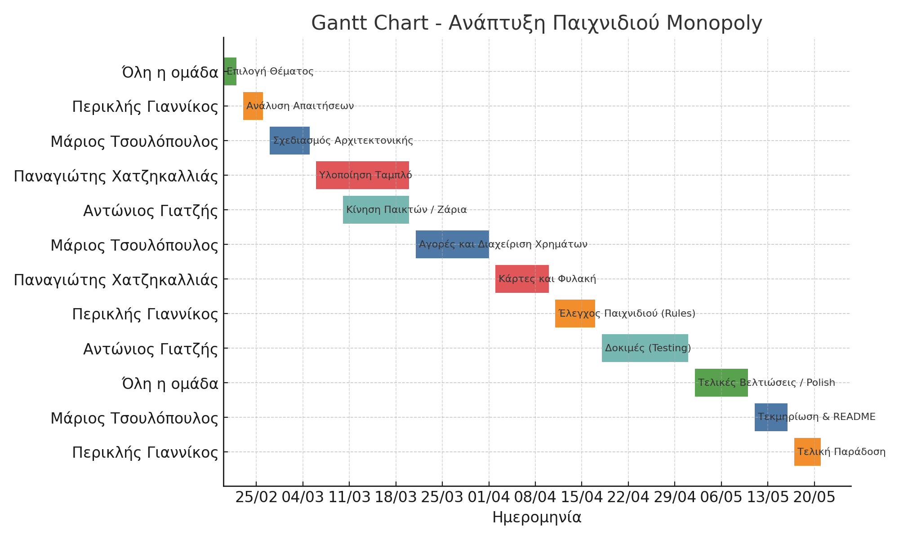

# Monopoly Game - Τεχνολογία Λογισμικού

Αυτό το έργο αποτελεί μια απλή υλοποίηση του γνωστού επιτραπέζιου παιχνιδιού **Monopoly**, ως εργασία στο μάθημα **Τεχνολογία Λογισμικού**. Το παιχνίδι επιτρέπει σε πολλούς παίκτες να κινούνται γύρω από το ταμπλό, να αγοράζουν ιδιοκτησίες και να ανταγωνίζονται οικονομικά, με στόχο τη χρεοκοπία των αντιπάλων τους.

Το έργο έχει υλοποιηθεί σε **Java** και περιλαμβάνει βασικά γραφικά για την απεικόνιση του ταμπλό και των παικτών. Επιπλέον, παρέχονται πληροφορίες για κάθε παίκτη, όπως το χρώμα του και το διαθέσιμο ποσό χρημάτων.

## Μέλη Ομάδας

| Όνομα        | Επώνυμο           | Α.Μ.     | Ρόλος                     |
|--------------|-------------------|----------|----------------------------|
| Μάριος       | Τσουλόπουλος      | ICS22190 | Software Architect         |
| Αντώνιος     | Γιατζής           | ICS25204 | QA Engineer / Tester       |
| Περικλής     | Γιαννίκος         | ICS22097 | Project Manager            |
| Παναγιώτης   | Χατζηκαλλιάς      | ICS24115 | Developer                  |

## 📊 Gantt Chart

