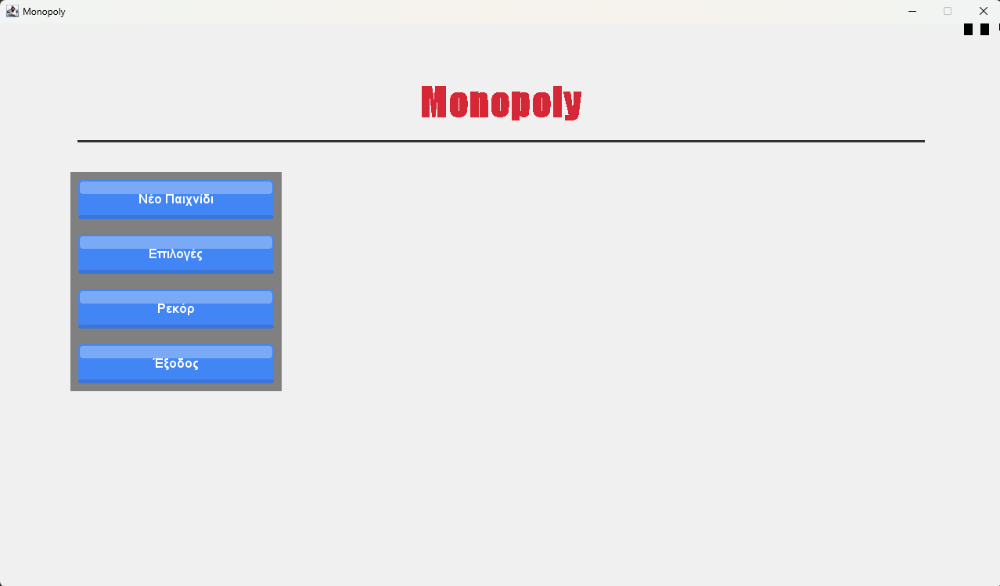
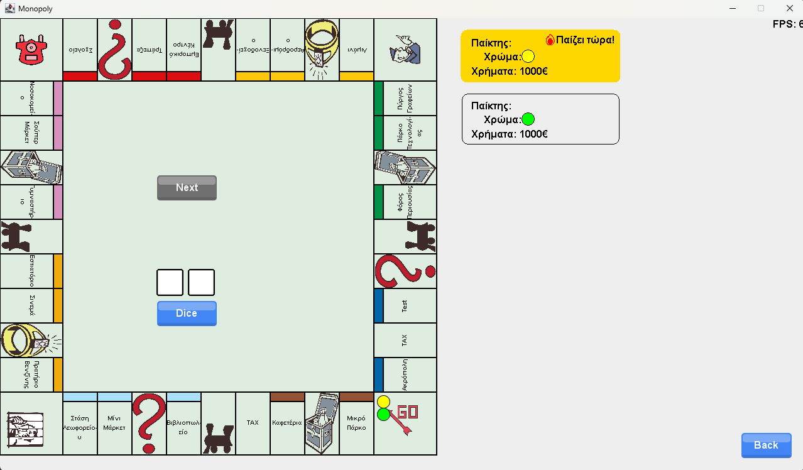
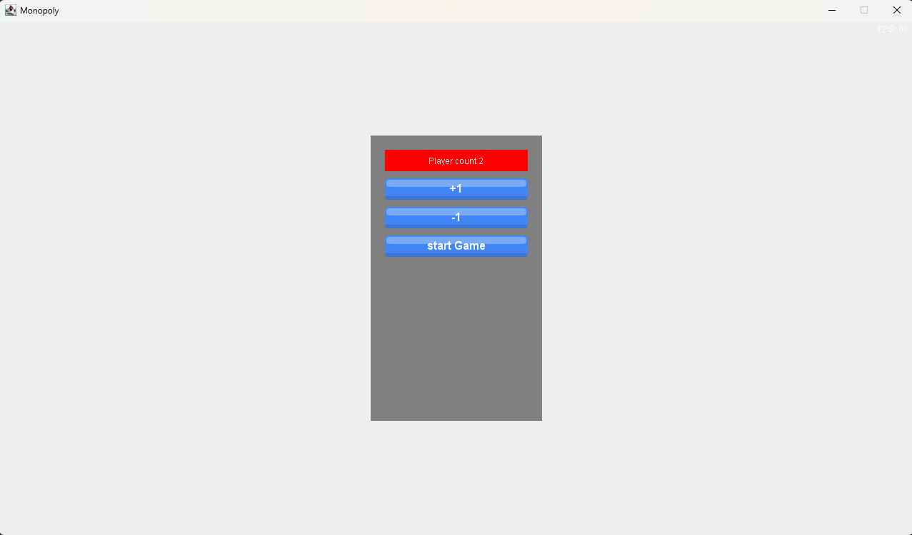
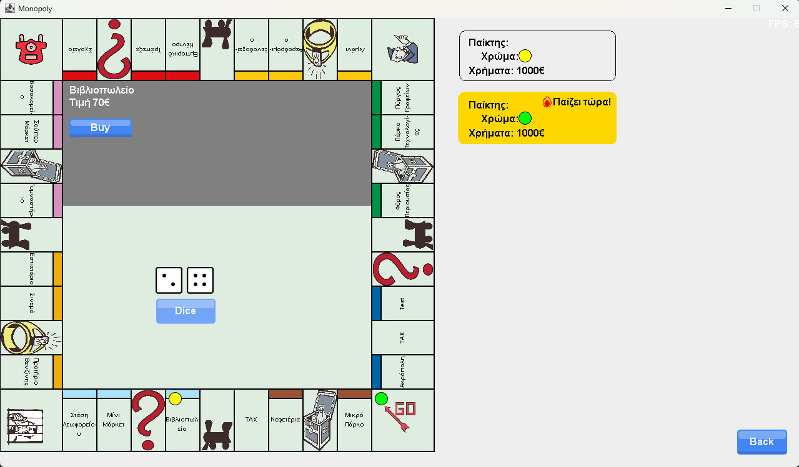
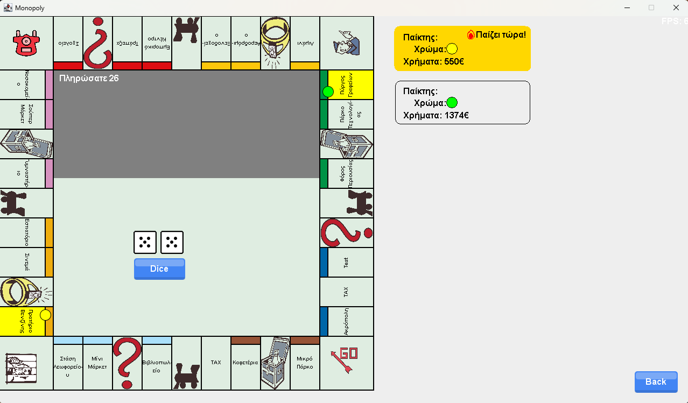
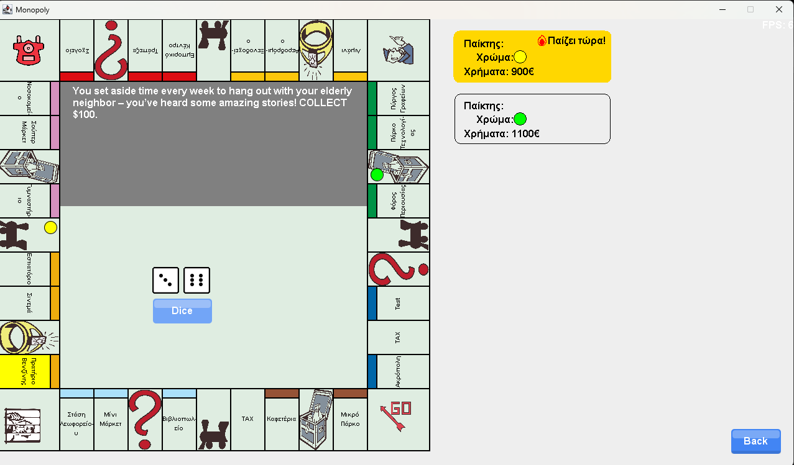
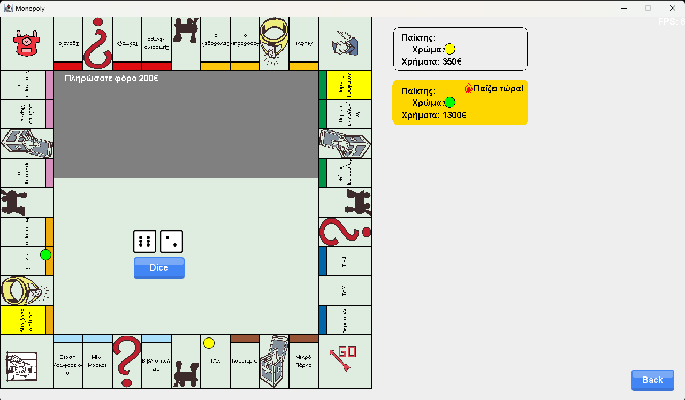

# Monopoly Game - Τεχνολογία Λογισμικού

Αυτό το έργο αποτελεί μια απλή υλοποίηση του γνωστού επιτραπέζιου παιχνιδιού **Monopoly**, ως εργασία στο μάθημα **Τεχνολογία Λογισμικού**. Το παιχνίδι επιτρέπει σε πολλούς παίκτες να κινούνται γύρω από το ταμπλό, να αγοράζουν ιδιοκτησίες και να ανταγωνίζονται οικονομικά, με στόχο τη χρεοκοπία των αντιπάλων τους.

Το έργο έχει υλοποιηθεί σε **Java** και περιλαμβάνει βασικά γραφικά για την απεικόνιση του ταμπλό και των παικτών. Επιπλέον, παρέχονται πληροφορίες για κάθε παίκτη, όπως το χρώμα του και το διαθέσιμο ποσό χρημάτων.

## Μέλη Ομάδας

| Όνομα        | Επώνυμο           | Α.Μ.     | Ρόλος                     |
|--------------|-------------------|----------|----------------------------|
| Μάριος       | Τσουλόπουλος      | ICS22190 | Software Architect         |
| Αντώνιος     | Γιατζής           | ICS25204 | QA Engineer / Tester       |
| Περικλής     | Γιαννίκος         | ICS22097 | Project Manager            |
| Παναγιώτης   | Χατζηκαλλιάς      | ICS24115 | Developer                  |

## 📊 Gantt Chart

## 🧩 Διάγραμμα Περιπτώσεων Χρήσης

## 📌 Διαγράμματα Ακολουθίας (Sequence Diagrams)

Παρακάτω παρατίθενται τα βασικά διαγράμματα που καλύπτουν τη ροή και τις περιπτώσεις χρήσης του παιχνιδιού Monopoly.

### 🟢 Διάγραμμα Διέλευση από Αφετηρία

### 🟢 Διάγραμμα Έναρξη Παιχνιδιού

### 🟢 Διάγραμμα Κάρτα Ταμείου

### 🟢 Διάγραμμα Κάρτα Τύχης

### 🟢 Διάγραμμα Φυλακή

### 🟢 Διάγραμμα Χτίσιμο

## 📐 Διάγραμμα Κλάσεων

## 🖼️ Screenshots

### Αρχικό Μενού

### Έναρξη Παιχνιδιού

### Αρχικοποίηση Παιχνιδιού

### Ρίψη Ζαριού

### Επιλογή Αγοράς Ιδιοκτησίας

### Πληρωμή Ενοικίου

### Κάρτα Ευκαιρίας (Chance)

### Φόρος

## ✅ Test cases

| #  | Description                                                                 | Test Data                                                                 | Expected Result                                                                 | Actual Result                            | Pass/Fail |
|----|------------------------------------------------------------------------------|---------------------------------------------------------------------------|----------------------------------------------------------------------------------|------------------------------------------|-----------|
| 1  | Εκκίνηση εφαρμογής και εμφάνιση κύριου μενού                               | Κανένα                                                                    | Εμφανίζεται το κύριο μενού με 4 κουμπιά                                        | Εμφανίστηκε το κύριο μενού               | Pass      |
| 2  | Επιλογή «Νέο Παιχνίδι» και επιλογή 2 παικτών                               | Κουμπί: Νέο Παιχνίδι, Αριθμός παικτών: 2                                  | Εμφανίζεται οθόνη επιλογής παικτών και μετά το tableau                          | Εμφανίστηκε το tableau με 2 παίκτες      | Pass      |
| 3  | Επιλογή μενού «Επιλογές» και αλλαγή προκαθορισμένου αριθμού παικτών σε 3   | Κουμπί: Επιλογές, Ρύθμιση παικτών = 3                                     | Οι ρυθμίσεις αποθηκεύονται και επιστροφή στο κύριο μενού                        | Αποθηκεύτηκαν σωστά                       | Pass      |
| 4  | Εκκίνηση νέου παιχνιδιού μετά από αλλαγή σε 3 παίκτες                      | Επιλογή «Νέο Παιχνίδι» μετά την περίπτωση 3                               | Το παιχνίδι ξεκινά με 3 παίκτες χωρίς νέα επιλογή                               | Ξεκίνησε με 3 παίκτες                     | Pass      |
| 5  | Επιλογή «Ρεκόρ» για εμφάνιση της καλύτερης παρτίδας                        | Κουμπί: Ρεκόρ                                                              | Εμφανίζεται η οθόνη με τον νικητή και το ταμπλό                                | Εμφανίστηκε σωστά                         | Pass      |
| 6  | Επιλογή «Έξοδος» για κλείσιμο της εφαρμογής                                | Κουμπί: Έξοδος                                                             | Η εφαρμογή τερματίζεται                                                         | Τερματίστηκε                              | Pass      |
| 7  | Αυτόματη πληρωμή από Παίκτη 1 προς Παίκτη 2 όταν προσγειώνεται σε ιδιοκτησία του | Παίκτης 1 στη θέση 8 (ιδιοκτησία του Παίκτη 2), ενοίκιο: €120           | Παίκτης 1: €1300 → €1180 Παίκτης 2: €1100 → €1220                           | Παίκτης 1: €1180 Παίκτης 2: €1220     | Pass      |
| 8  | Ο Παίκτης 1 επιλέγει να αγοράσει διαθέσιμη ιδιοκτησία                     | Παίκτης 1 στη θέση 11 (κόστος αγοράς: €200)                               | Παίκτης 1: €1500 → €1300 Η ιδιοκτησία ανήκει στον Παίκτη 1                  | Παίκτης 1: €1300 Καταχωρήθηκε ιδιοκτησία στον Παίκτη 1 | Pass      |
| 9  | Ο Παίκτης 1 δεν έχει αρκετά χρήματα να πληρώσει ενοίκιο και χρεοκοπεί     | Παίκτης 1 έχει €50, προσγειώνεται σε θέση με ενοίκιο €200 (ανήκει στον Παίκτη 2) | Παίκτης 2 χάνει το παιχνίδι, οι ιδιοκτησίες του μεταβιβάζονται ή διαγράφονται | Παίκτης 2 αποκλείστηκε, οι ιδιοκτησίες διαγράφηκαν | Pass      |
| 10 | Ο Παίκτης 1 περνά από τη θέση "Αφετηρία" και λαμβάνει το μπόνους           | Θέση Παίκτη 1 πριν: 38, Ζαριά: 6 (τερματίζει στη θέση 4)                  | Παίκτης 1: €900 → €1100 (έλαβε +€200)                                          | Παίκτης 1: €1100                          | Pass      |

## Youtube
(https://youtu.be/0ckc7-Oat9E)
